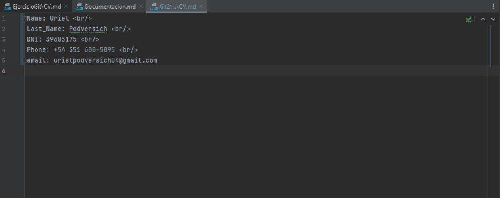

Como realize el ejercicio de git:

<h2><b>Actividad 2:</b></h2>  

<h1> Crear un repositorio local y agregar archivos </h1>  

- Crear un repositorio local en un nuevo directorio.  
- Agregar un archivo Readme.md, que contenga tu nombre y un link a tu CV. Tu cv será otro archivo en el mismo formato, en la misma carpeta.  
Aclaración: No pongas información personal como DNI, email o telefono en tu cv, puede tener información Falsa si lo prefieren.  
- Crear los commits de cada caso y proveer mensajes descriptivos.  

Cree una carpeta para poder tener en ella todos los archivos de el ejercicio llamada EjercicioGit

Luego cree dentro de ella un repositorio con el comando: (git init).

Despues cree 2 archivos uno es el Readme.md y el otro es CV.md, el cual le coloque todos datos
falsos excepto por el nombre y el apellido. 

Luego, en el archivo Readme.md puse un link que va a llevar directo a el CV.md, para ello 
coloque (parentesis) , la ruta en donde se encuentra el archivo y el nombre del archivo que
quiero linkear. Del lado izquierdo puse [corchetes]y el mensaje que yo quisiera que tuviera. 
Ejemplo:

<h2><b>Actividad 3:</b></h2>  
<h1> Crear un repositorio remoto </h1>  

- Crear una cuenta en https://github.com
- Crear un nuevo repositorio en dicha página (vacío)
- Asociar el repositorio local creado en el punto 2 al creado en github.
- Subir los cambios locales a github.

Cree un repositorio en GitHub llamado EjerciciosGit.

Una vez que termine de crear los archivos, "linkear" los mismos y crear el repositorio GitHub, escribi en la terminal: 
git branch (nombre) (permite crear, enumerar y eliminar ramas, así como cambiar su nombre).                               
git remote add origin (link del repositorio)(permite crear, ver y eliminar conexiones con otros repositorios).            
git add . (añade un cambio del directorio de trabajo, con el . añado todos los archivos/directorios).                  
git commit -m " " (sacas "screenshot" de los cambios que hubo en ese momento del proyecto y agregas un mensaje descriptivo).  
  git push (carga contenido del repositorio local a un repositorio remoto)                                                 

<h2><b>Actividad 4:</b></h2>  
<h1>Familiarizarse con el concepto de Pull Request </h1>
<h3> Para algunos de los puntos proveer imágenes o videos. <h3>  

Crear un branch local y agregar cambios a dicho branch.
El cambio debe ser un archivo md donde se explique que es un pull request y un link a éste en el readme.  
Subir el cambio a dicho branch y crear un pull request.
Completar el proceso de revisión en github y mergear el PR al branch master. 

Cree otra rama a la cual la llame local. Para eso use el comando:  
git branch local  
Para luego posicionarme sobre la rama local use el comando:  
git checkout local (El comando git checkout te permite desplazarte entre las ramas creadas por git branch).

Estando posicionado en la rama local agrego los archivos con "git add ." luego creo el/los commit correspondientes y
subo los cambios al repositorio GitHub -EjercicioGit-.

Una vez subido la rama local al Github, voy al repositorio GitHub -EjercicioGit, clickee el boton de compare & pull request.

Creo el pull request.

Una vez que se confirma que no hay conflictos con la rama, clickeo el boton de merge pull request.

Confirmo el merge.

El pull request salio bien, por lo tanto aparecio el siguiente mensaje.

Como los cambios se hicieron en el repositorio GitHub, me cambio a la rama main con "git checkout main" y luego hago un pull
con el comando: 
git pull origin main (El comando git pull se emplea para extraer y descargar contenido desde un repositorio remoto y actualizar al instante el repositorio local para reflejar ese contenido.)

<h2><b>Actividad 5:</b></h2>  
<h1> Mergear código con conflictos </h1>
<h3> Para algunos de los puntos proveer imágenes o videos. <h3>  

- Instalar alguna herramienta de comparación
Ejemplos: SmartGit, GitEye, plugin para vscode. pycharm, etc.

- Clonar en un segundo directorio de tu equipo el repositorio creado en github.

- En el clon inicial, modificar el CV.md cambiando algunas lineas.

- Hacer commit y subir el cambio a master a github.
En el segundo clon también realizar cambios en las mismas líneas que se modificaron en el otro directorio.

- Intentar subir el cambio, haciendo un commit y push. Mostrar el error que se obtiene.

- Hacer pull y mergear el código (solo texto por ahora), mostrar la herramienta de mergeo como luce.
Resolver los conflictos del código.

- Explicar las versiones LOCAL, BASE y REMOTE.
Pushear el cambio mergeado.

Lo que hice a continuacion fue clonar el repositorio en otro directorio.

Luego en el clon modifique el mail para intentar que exista un conflicto a la hora de mergear.

Original:

Clone:

Después, agrego el archivo modificado con "git add ." y creo el commit correspondiente.

Intento pusher pero termina saliendo un error. 

Hago un pull e intento mergear, sale un error que dice que se encuentra un conflicto y por eso no puede ser mergeado.

Resuelvo el codigo que contiene el conflicto. Luego agrego todos los archivos modificados y creo los commit correspondientes.

Cree un archivo que se llama Versiones.md en el cual contiene la explicacion de las versiones LOCAL, BASE, REMOTE.

Se pusheo todo lo realizado hasta ahora.  

<h2><b>Actividad 6:</b></h2>  
<h1> Algunos ejercicios online </h1>  

- Entrar a la página https://learngitbranching.js.org/
- Completar los ejercicios Introduction Sequence
- Opcional - Completar el resto de los ejercicios para ser un experto en Git :D !!!

Adjunto imagen de los ejercicios resueltos en la pagina.

<h2><b>Actividad 7:</b></h2>  
<h1>Crear Repositorio de la materia</h1>  

- Crear un repositorio para la materia en github. Por ejemplo ANT (Diferente al de este trabajo práctico)  
- Subir archivo(s) .md con los resultados, imágenes y/o videos de este trabajo práctico a ese repositorio. Puede ser en una subcarpeta trabajo-practico-01, con su propia rama, como mas le guste, pero en el README.md deberán explicar como encuentro el resultado.

Cree repositorio de la materia

Se agregaron todos los archivos al repositorio

