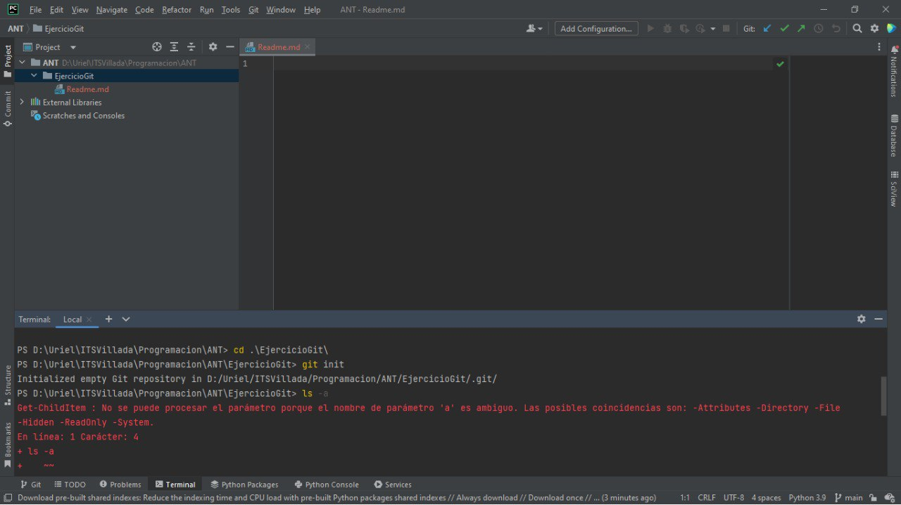
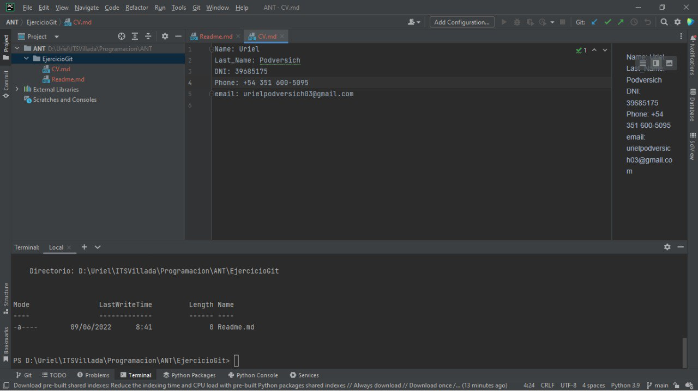
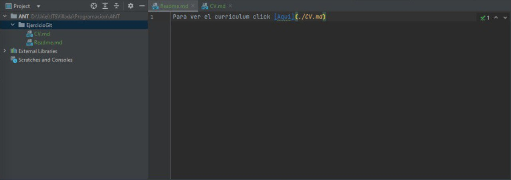
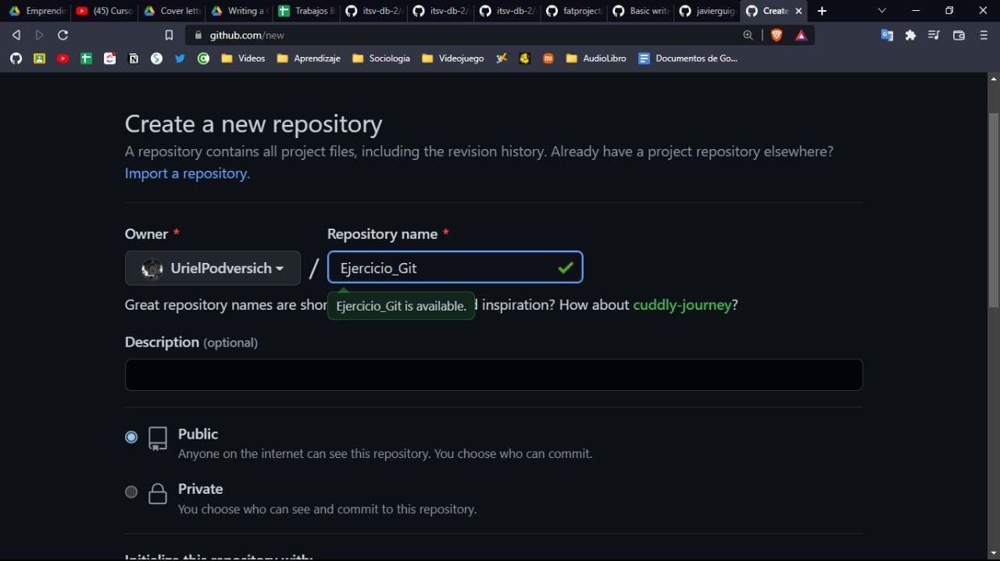
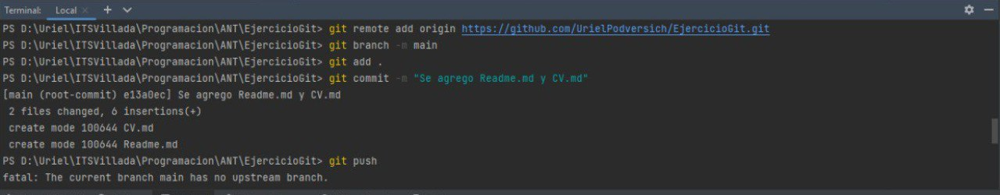
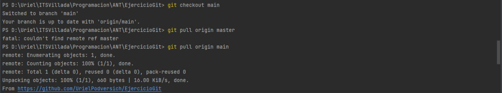

Como realize el ejercicio de git:
cree una carpeta para poder tener en ella todos los archivos de el ejercicio llamada EjercicioGit

Luego cree dentro de ella un repositorio con el comando: (git init).

Despues cree 2 archivos uno es el Readme.md y el otro es CV.md, el cual le coloque todos datos
falsos excepto por el nombre y el apellido. 

Luego, en el archivo Readme.md puse un link que va a llevar directo a el CV.md, para ello 
coloque (parentesis) , la ruta en donde se encuentra el archivo y el nombre del archivo que
quiero linkear. Del lado izquierdo puse [corchetes]y el mensaje que yo quisiera que tuviera. 
Ejemplo:

Cree un repositorio en GitHub llamado EjerciciosGit.

Una vez que termine de crear los archivos, "linkear" los mismos y crear el repositorio GitHub, escribi en la terminal: 
git branch (nombre) (permite crear, enumerar y eliminar ramas, así como cambiar su nombre).                               
git remote add origin (link del repositorio)(permite crear, ver y eliminar conexiones con otros repositorios).            
git add . (añade un cambio del directorio de trabajo, con el . añado todos los archivos/directorios).                  
git commit -m " " (sacas "screenshot" de los cambios que hubo en ese momento del proyecto y agregas un mensaje descriptivo).  
  git push (carga contenido del repositorio local a un repositorio remoto)                                                 

Cree otra rama a la cual la llame local. Para eso use el comando:  
git branch local  
Para luego posicionarme sobre la rama local use el comando:  
git checkout local (El comando git checkout te permite desplazarte entre las ramas creadas por git branch).

Estando posicionado en la rama local agrego los archivos con "git add ." luego creo el/los commit correspondientes y
subo los cambios al repositorio GitHub -EjercicioGit-.

Una vez subido la rama local al Github, voy al repositorio GitHub -EjercicioGit, clickee el boton de compare & pull request.

Creo el pull request.

Una vez que se confirma que no hay conflictos con la rama, clickeo el boton de merge pull request.

Confirmo el merge.

El pull request salio bien, por lo tanto aparecio el siguiente mensaje.

Como los cambios se hicieron en el repositorio GitHub, me cambio a la rama main con "git checkout main" y luego hago un pull
con el comando: 
git pull origin main (El comando git pull se emplea para extraer y descargar contenido desde un repositorio remoto y actualizar al instante el repositorio local para reflejar ese contenido.)

